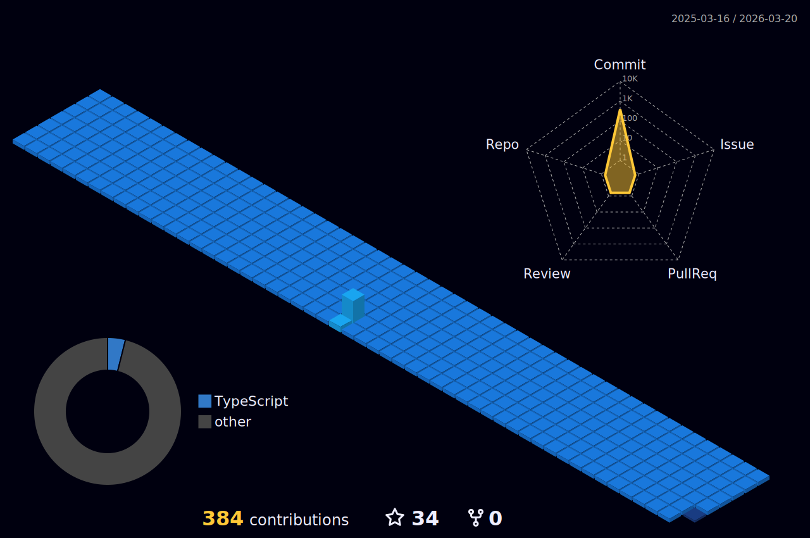

  
  
<!--
**dongmin115/dongmin115** is a ✨ _special_ ✨ repository because its `README.md` (this file) appears on your GitHub profile. 
Here are some ideas to get you started:

- 🔭 I’m currently working on ...
- 🌱 I’m currently learning ...
- 👯 I’m looking to collaborate on ...
- 🤔 I’m looking for help with ...
- 💬 Ask me about ...
- 📫 How to reach me: ...
- 😄 Pronouns: ...
- ⚡ Fun fact: ...
-->

  
## ⚒️ Tech Stack ⚒️

### 🎨 Front-end 🎨

### 📞 Collaboration Tool 📞

## Github Stats

